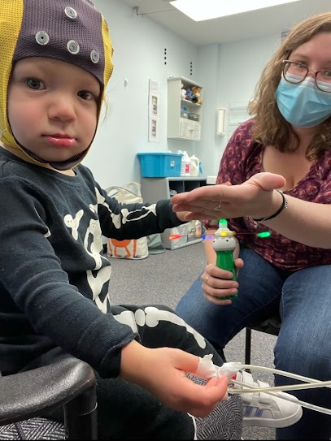

#
#

## **Motor experience and body representations**


#### *The development of grasping and later neural representation of fingers* 

```{r bbeeg, echo=FALSE,  out.width = '30%', out.extra='style="float:right; padding:10px"', fig.align = 'right'}



```

A project through the Developmental Science Lab at Temple University is currently studying how infants learn to reach and grasp for a pencil from 6 to 14-months. We use a customized software (TrHandy, Ab.Acus) to code videos submitted by parents and can extract the kinematic properties of the reach and grasp. Of particular interest is the emergence of the mature pincer grasp. At 14-months, infants come to the lab and participate in a tactile oddball paradigm stimulating their fingertips while undergoing EEG. Of particular interest is a neural signature (somatosensory mismatch negativity - sMMN) in the frontocentral regions. We hypothesize that functional differences in the way infants use their pinky and middle fingers to grasp will relate to neural body representations, manifesting as greater sMMN in response to a tactile stimulation of the middle finger versus the pinky finger. 


For more information - https://sites.temple.edu/devscilab/babygrasp/ 

#
#
# 

#### *Motor experience and neural plasticity in finger representations* 

A complimentary project with older participants also uses the tactile oddball paradigm and sMMN.Here, we hypothesize that neural plasticity persists into adulthood and motor experience can change the neural representation of digits. Undergraduates participate in a typing test, a traditional measure of finger independence, and complete questions about video game and music experience. We expect that more experience using individual fingers and greater finger independence will lead to  greater sMMN in response to a tactile stimulation of the middle finger versus the pinky finger. 

#
#
#
#
```{r fig3, echo=FALSE,  out.width = '40%', out.extra='style="float:right; padding:10px"', fig.align = 'right'}

knitr::include_graphics("images/fig3.png")

```

## **Cognitive and motor development and sleep**

#### *Cognition-action tradeoffs and the organization of attention* 

This chapter discusses what cognition–action trade-offs in infancy reveal about the
organization and developmental trajectory of attention. We focus on internal attention
because this aspect is most relevant to the immediate concerns of infancy, such as fluctuating
levels of expertise, balancing multiple taxing skills simultaneously, learning how
to control attention under variable conditions, and coordinating distinct psychological
domains. Cognition–action trade-offs observed across the life span include perseveration
during skill emergence, errors and inefficient strategies during decision making, and
the allocation of resources when attention is taxed. An embodied cognitive-load
account interprets these behavioral patterns as a result of limited attentional resources
allocated across simultaneous, taxing task demands. For populations where motor
errors could be costly, like infants and the elderly, attention is typically devoted to motor
demands with errors occurring in the cognitive domain. In contrast, healthy young
adults tend to preserve their cognitive performance by modifying their actions.

```{r, echo=FALSE}
downloadthis::download_link(
  link = "https://github.com/mhorger/MNHwebsite/blob/b022659d6690c61afa8397b694a193b4516b2e7e/articles/Berger,%20Harbourne,%20&%20Horger%202018.pdf",
  button_label = "Download pdf file",
  button_type = "danger",
  has_icon = TRUE,
  icon = "fa fa-save",
  self_contained = FALSE
)
```
#
#
#
#### *Motor development in context* 

The study of motor development has traditionally focused on the timing and sequence of the acquisition of motor skills, such as sitting, crawling, or walking, over the first years of life. Because motor skills are directly observable, motor development serves as a useful exemplar for general principles of development. Current frameworks emphasize motor development in and as a context, such as how change in motor skill interacts with simultaneous change in other developmental domains, how the acquisition of new motor skills creates new opportunities for learning, and how the context in which motor development occurs shapes the course of development. For example, the onset of new motor skills changes the allocation of attentional resources, the quality of infants’ sleep, and available perceptual information. Reciprocally, contexts such as culturally specific parenting practices and individual differences in everyday experiences impact the timing and trajectory of new motor skills.

```{r, echo=FALSE}
downloadthis::download_link(
  link = "https://github.com/mhorger/MNHwebsite/blob/a4ead575b0eb2c2d613bff9630a140fde15c5e1f/articles/Berger,%20Horger,%20DeMasi,%20&%20Karasik%20(2021)%20Motor%20development%20in%20context.pdff",
  button_label = "Download pdf file",
  button_type = "warning",
  has_icon = TRUE,
  icon = "fa fa-save",
  self_contained = FALSE
)
```
#
#
#
```{r tun, echo=FALSE,  out.width = '40%', out.extra='style="float:right; padding:10px"', fig.align = 'right'}

knitr::include_graphics("images/tunnel.png")

```

#### *The impact of motor experience on exploration and problem solving*

One hundred and six infants with varied independent walking experience faced the problem of
navigating a tunnel to reach a caregiver. Solving the task required infants to switch from standing
to crawling so they could fit their bodies into the tunnel. Spontaneous exploratory behaviors were
documented. Infants who did not immediately go through the tunnel received a strict 15-step
training protocol to highlight relevant details of the task. Age and walk experience were entered
as predictors into a series of stepwise regressions on measures of exploratory and problem-solving
behaviors. In general, older infants were more successful than younger infants in completing the
task. A significant nonlinear relationship was documented between walk experience and some
outcome measures. Infants with a moderate amount of walk experience had more difficulty than
those with very little or a lot. Microgenetically documenting problem solving as a function of
experience revealed that attention is taxed during mastery of a motor skill. Availability of attentional
resources, in turn, impacted

```{r, echo=FALSE}

downloadthis::download_link(
  link = "https://github.com/mhorger/MNHwebsite/blob/b022659d6690c61afa8397b694a193b4516b2e7e/articles/Horger%20&%20Berger%20(2019)%20The%20role%20of%20walking%20experience%20on%20whole%20body%20exploration%20and%20problem%20solving.pdf",
  button_label = "Download pdf file",
  button_type = "success",
  has_icon = TRUE,
  icon = "fa fa-save",
  self_contained = FALSE
)
```
#
#
#
#### *Newly walking infants’ night sleep impacts next day learning and problem solving*
Sleep is part of the process that prepares children and adults for next day cognitive activity. Insufficient or fragmented sleep has a detrimental impact on subsequent encoding (Rouleau et al., 2002) and cognitive functioning (Joo et al., 2012). However, fragmented sleep early in life is a developmental norm, limiting the extent to which conclusions derived from older populations can be generalized. To directly test the continuity of this relationship, newly-walking infants’ (N = 58) sleep was monitored overnight using actigraphy. The next morning they were taught a motor problem-solving task. The task required infants to navigate through a tunnel to reach a goal at the other end. We coded infants’ exploratory behaviors and the extent of training required to solve the task. Using a cluster analysis that accounted for exploratory behaviors and number of training prompts, infants were sorted into three profiles: those who found the task Easy to solve, those who found it Difficult, and those who Never solved it. Wake episodes and sleep efficiency were entered as predictors of cluster membership in a multinomial logistic regression. Of the infants who ultimately solved the task, those with more wake episodes and lower sleep efficiency had more difficulty. Specifically, fragmentation appeared to negatively impact preparedness to learn. Contrary to our expectations, infants who Never solved the task had the least fragmented sleep, indicating that an optimal level of fragmentation is needed for efficient problem-solving. For infants, some level of sleep fragmentation is needed the night before learning in order to solve a task efficiently. These findings highlight the interaction between developmental domains, from sleep quality to motor experience, and their impact on infant learning in real time.

```{r, echo=FALSE}

downloadthis::download_link(
  link = "https://github.com/mhorger/MNHwebsite/blob/f08d832d73d17e015f5c724b3fbac234826ebc47/articles/Horger%20et%20al%20(2021)%20Newly%20walking%20infants'%20night%20sleep%20impacts%20next%20day%20learning%20and%20problem%20solving.pdf",
  button_label = "Download pdf file",
  button_type = "primary",
  has_icon = TRUE,
  icon = "fa fa-save",
  self_contained = FALSE
)
```
#
#
#

#### *Nap timing makes a difference: Sleeping sooner rather than later after learning improves infants’ locomotor problem solving*

Twenty-nine newly-walking infants who had recently given up crawling trained to navigate a
shoulder-height, nylon tunnel to reach a caregiver waiting at the other end. Infants in the Nap
First group napped within 30 min of initial training. Infants in the Delay First group napped four
hours after training. All infants were retested six hours after training on the same locomotor
problem. Learning was measured by the number of training prompts required to solve the task,
exploration, and time to solve the problem. Nap First infants benefited the most from a nap; they
required fewer training prompts, used fewer posture shifts from training to test, and solved the
task faster compared to Delay First infants, suggesting that optimally timed sleep does not merely
protect against interference, but actively contributes to memory consolidation. This study highlights
the importance of nap timing as a design feature and was a first step towards limit-testing
the boundaries of the relation between sleep and learning. Infants’ fragile memories require
regular consolidation with intermittent periods of sleep to prevent interference or forgetting.

```{r, echo=FALSE}

downloadthis::download_link(
  link = "https://github.com/mhorger/MNHwebsite/blob/b022659d6690c61afa8397b694a193b4516b2e7e/articles/DeMasi%20et%20al%20(2021)%20Nap%20timing%20makes%20a%20difference.pdf",
  button_label = "Download pdf file",
  button_type = "info",
  has_icon = TRUE,
  icon = "fa fa-save",
  self_contained = FALSE
)
```
#
#
#

```{r isdp20, echo=FALSE,  out.width = '40%', out.extra='style="float:right; padding:10px"'}

knitr::include_graphics("images/twitterposter.gif")
```

#### *Longitudinal assessment of sleep and motor milestone acquisition.*

By using Nanit video baby monitors and parent reported motor skill diaries, we get a prospective glimpse into infants' sleep around the acquisition of new motor skills.  


In one investigation, Nanit provided nightly sleep summaries statistics including number of wake episodes, sleep efficiency, total sleep time, and sleep onset latency. We looked for patterns in the nights immediately before and after the acquisition of sitting, pulling to stand, hands-and-knees crawling, cruising, and walking. 

In a second study, complete nights of video were state scored into REM, NREM, indeterminate sleep, and wake. We focused on the nights before, of, and after the onset of sitting, crawling, and walking.


#
#
#
#


## **Methods for studying sleep**

#### *Comparing researcher choices for sleep assessment* 

Incorporating infant sleep, either as a predictor or as an outcome variable,
into interdisciplinary work has become increasingly popular. Sleep researchers
face many methodological choices that have implications for the reliability
and validity of the data. Here, the authors directly investigated the
impact of design and measurement choices in a small, longitudinal sample
of infants. Three sleep measurement techniques—parent-reported sleep diaries,
actigraphy (Micromini Sleep Watch), and a commercial videosomnography
(Nanit)—were included, using actigraphy as the baseline. Nine infants’
sleep (4 girls) was measured longitudinally using all three measurement
techniques. Nanit provided summary statistics, using a proprietary algorithm,
for nightly sleep parameters. The actigraphy data were analyzed with
both the Sadeh Infant and Sadeh algorithms. The extent to which measurements
converged on sleep start and end time, number of wake episodes,
sleep efficiency, and sleep duration was assessed. Measures were positively
correlated. Difference scores revealed similar patterns of greater sleep estimation
in parent reports and Nanit compared with actigraphy. Bland-
Altman plots revealed that much of the data were within the limits of
agreement, tentatively suggesting that Nanit and actigraphy may be used
interchangeably. Graphs display significant variability within and between
individual infants as well as across measurement techniques. Potential confounding
variables that may explain the discrepancies between parent
report, Sadeh Infant, Sadeh, and Nanit are discussed. The findings are also
used to speak to the advantages and disadvantages of design and measurement
choices. Future directions focus on the unique contributions of each
measurement technique and how to capitalize on them.

```{r, echo=FALSE}

downloadthis::download_link(
  link = "https://github.com/mhorger/MNHwebsite/blob/b022659d6690c61afa8397b694a193b4516b2e7e/articles/DeMasi%20et%20al%20(2021)%20Nap%20timing%20makes%20a%20difference.pdf",
  button_label = "Download pdf file",
  button_type = "default",
  has_icon = TRUE,
  icon = "fa fa-save",
  self_contained = FALSE
)
```
#
#
#
#### *New in-home methods for studying sleep states in infancy* 

I developed a technique using wireless cardiorespiratory sensors and an actigraph to code infant sleep states. The procedure is easy enough for parents to incorporate into their usual bedtime routines. Parents and babies become part of the research team! 

```{r babysci, echo=FALSE,  out.width = '30%', fig.align = 'center'}


```


