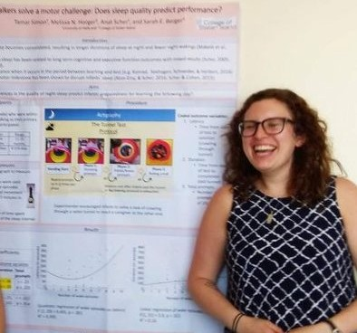

```{r me, echo=FALSE,  out.width = '35%', out.extra='style="float:left; padding:10px"',  fig.align = 'center'}

```


### Dr. Melissa Horger is currently a postdoctoral fellow at Temple University. She works in the Developmental Science Lab under the advisement of Dr. Peter Marshall. She completed her doctoral degree at the Graduate Center in September 2021. Her dissertation was an interdisciplinary investigation of infant sleep, discussing the methodologies of the field and linking sleep to motor development. Before graduate school, Dr. Horger attended Millersville University and then spent several years working at the Vista School in Hershey, PA. 


</div>

