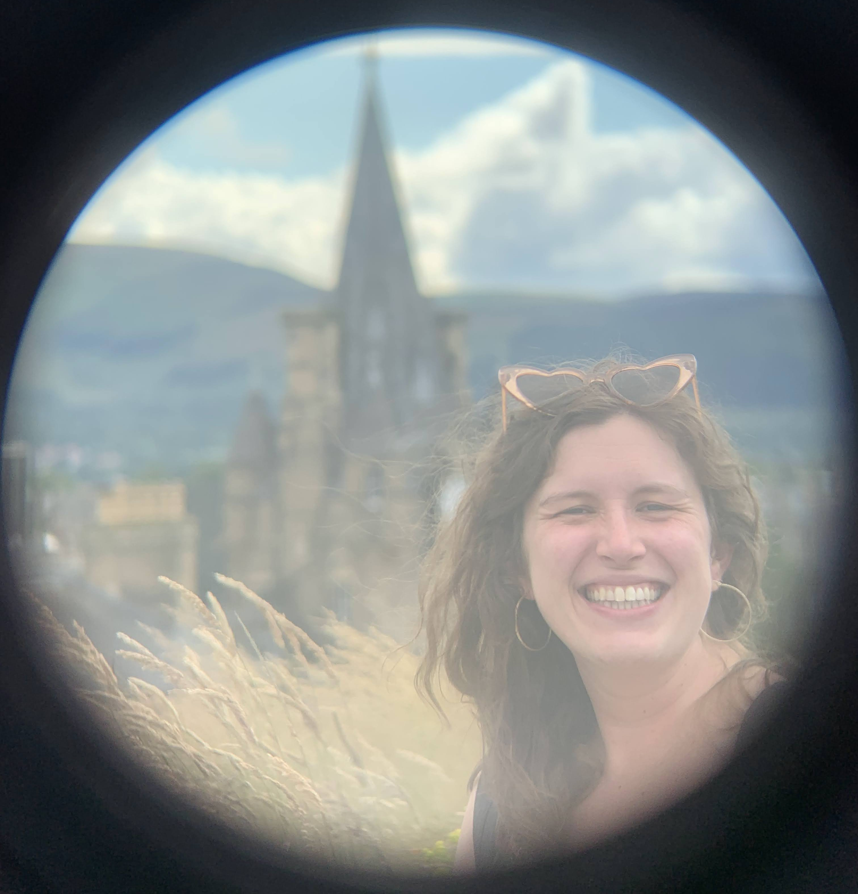
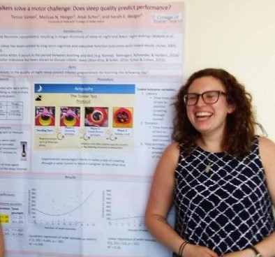
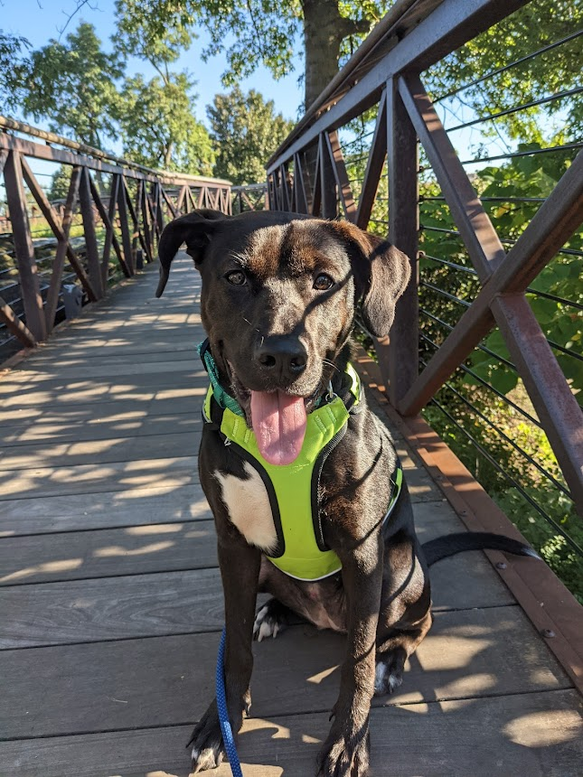
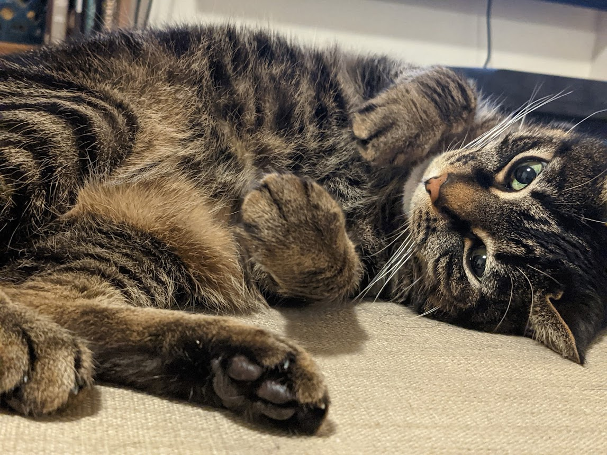

```{r headshot_scotland, echo=FALSE,  out.width = '35%', out.extra='style="float:right; padding:10px"',  fig.align = 'center'}

```


#
#
#


#### Dr. Melissa Horger is currently a postdoctoral fellow in the Somneuro Lab at UMass Amherst. She worked on two large federal grants on sleep and memory consolidation in infants and preschoolers. Recently, she was awarded an F32 grant to study the impact of neural oscillations during sleep on motor learning and development. 

#
#### In her previous appointment at Temple University, Melissa worked in the Developmental Science Lab to examine the impact of motor experience on neural plasticity. She ran parallel studies in infants and young adults to quantify manual motor expertise through kinematic analyses and related these to individual differences in the somatotopic mapping in the cortex. 

#
#### She completed her doctoral degree at the Graduate Center in September 2021. Her dissertation was an interdisciplinary investigation of infant sleep, discussing the methodologies of the field and linking sleep to motor development. 

```{r me, echo=FALSE,  out.width = '35%', out.extra='style="float:right; padding:10px"',  fig.align = 'center'}
#
```

#
#

#### Dr. Horger published over 10 empirical research articles in addition to book chapters and literature reviews. She has implemented 13 different research protocols in pediatric and adult populations with diverse methodologies including surveys, behavioral observations and coding, cardiorepiratory monitoring, EEG, and standarized assessments. Across the different protocols, she has played a key role in design, IRB submission and reporting, organization, data collection, analysis, and dissemination. A comprehensive list of her skills and experiences can be found in her resume or CV.

```{r, echo=FALSE}
#all protocols include eye tracker, learning curve, 3dayacti, LSI/LIS, methodology, nanit_long, sleep states, PECSIS, igrip, ugrip, hsr, itns, na_rr
```


#
#
```{r, echo=FALSE}
downloadthis::download_link(
  link = "https://github.com/mhorger/MNHwebsite/raw/main/docs/resume_cv/MHorger_CV.pdf",
  button_label = "CV",
  button_type = "default",
  has_icon = TRUE,
  icon = "fa fa-link",
  self_contained = FALSE
)
```

```{r, echo=FALSE}
downloadthis::download_link(
  link = "https://github.com/mhorger/MNHwebsite/raw/main/docs/resume_cv/Horger_Resume.pdf",
  button_label = "Resume",
  button_type = "default",
  has_icon = TRUE,
  icon = "fa fa-link",
  self_contained = FALSE
)
```

```{r har, echo=FALSE,  out.width = '35%', fig.align='center'}
#### Outside of the lab, she enjoys going to concerts, traveling, hiking, and spending time with her pets, Harley (the dog) and Pickles (the cat). 
#
```

```{r pic, echo=FALSE,  out.width = '45%', fig.align='center'}
#
```